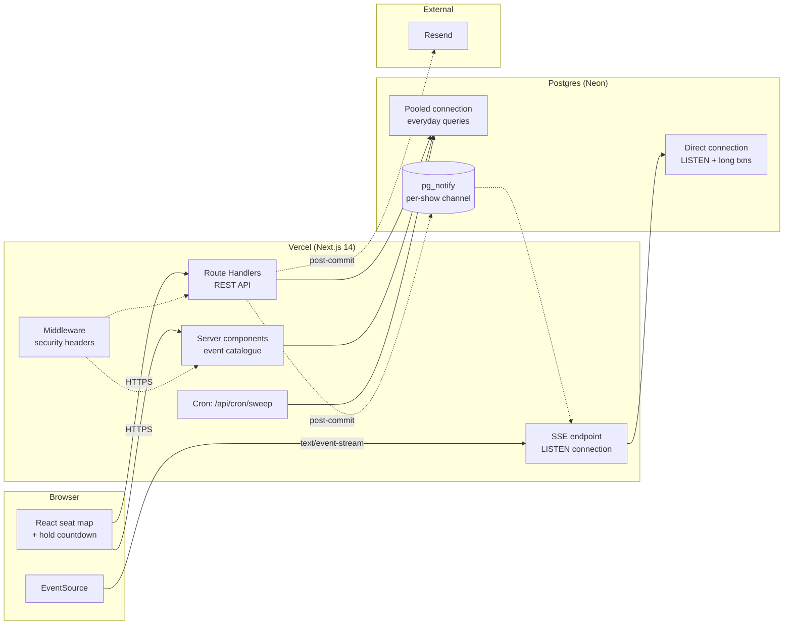
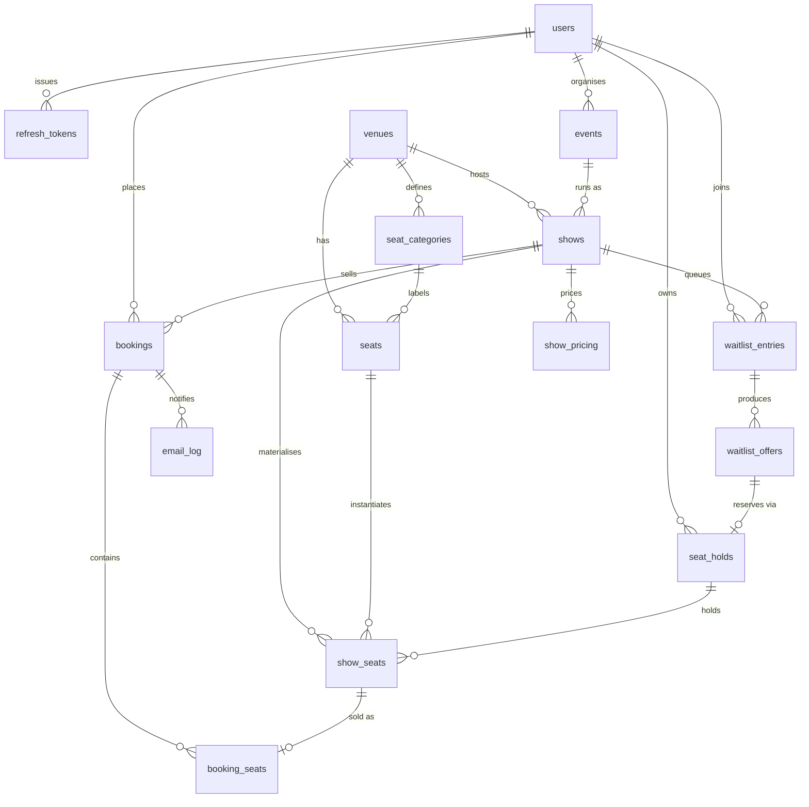
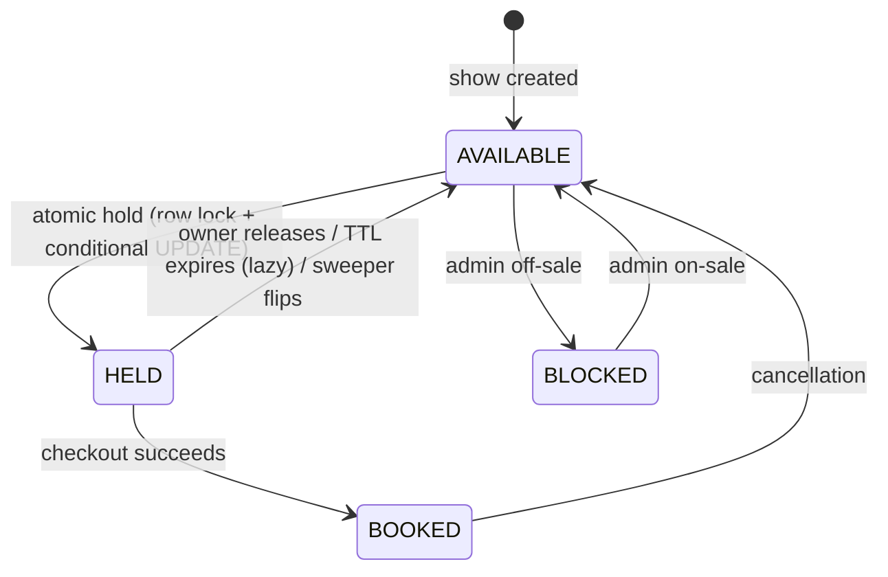
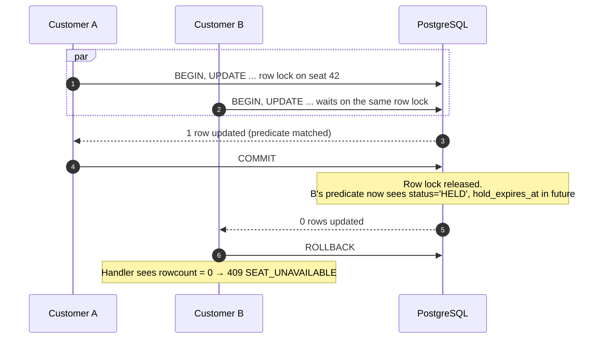
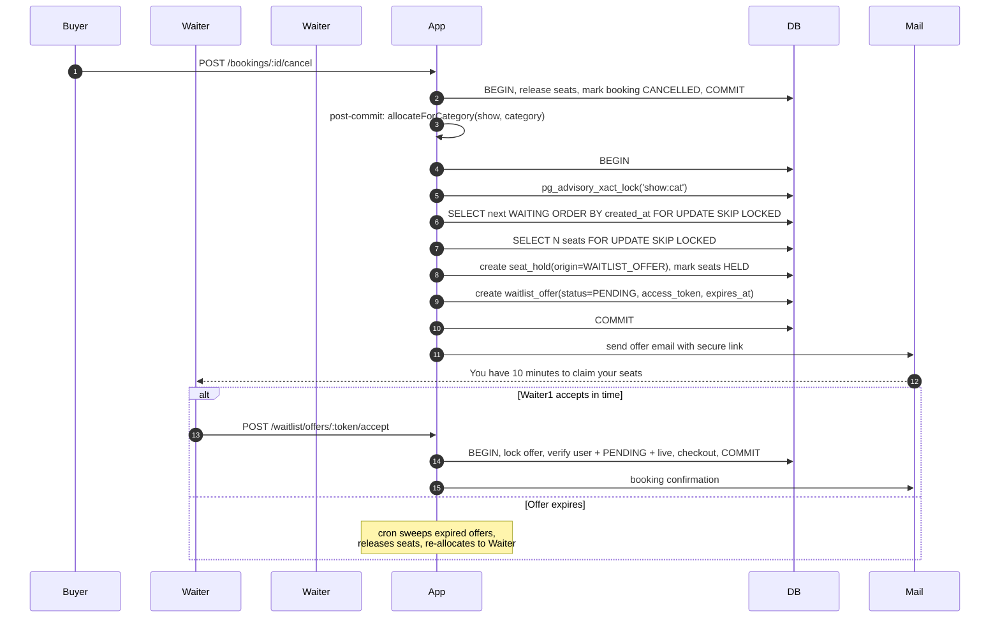
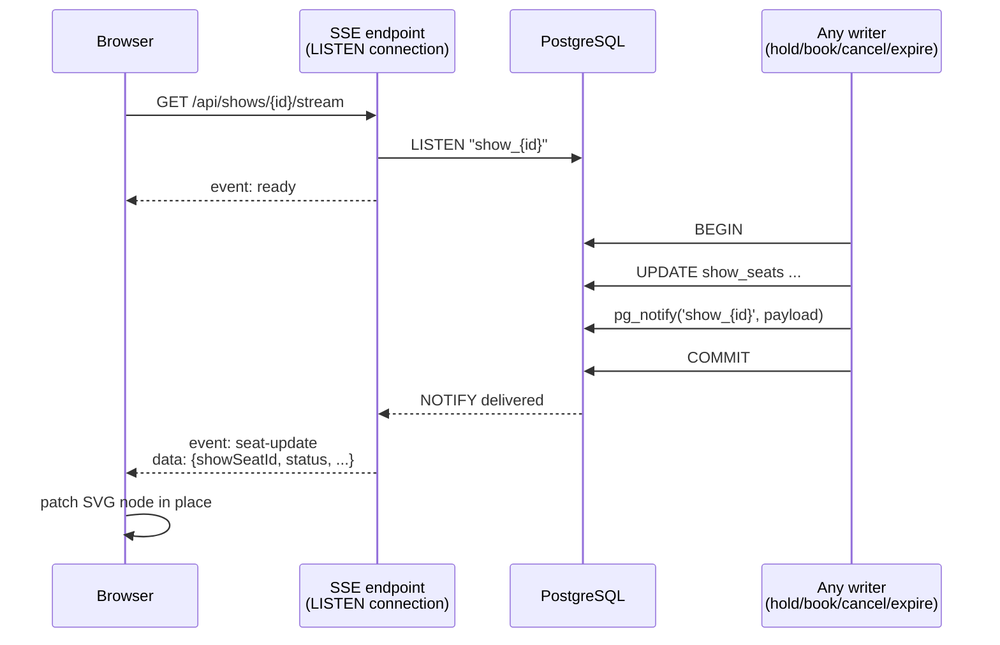

# Ticket Booking System

Book seats for movies and concerts. Live seat map, atomic holds with a 10-minute TTL, transactional checkout, FIFO waitlist that auto-promotes on cancellations, and emailed QR tickets.

<!-- ────────────────────────────────────────────────────────────── -->
<!-- 🔗 PASTE YOUR LIVE VERCEL URL BETWEEN THE QUOTES BELOW        -->
<!-- ────────────────────────────────────────────────────────────── -->

> **Live application:** *https://your-app.vercel.app* &nbsp;·&nbsp; **API health:** *https://your-app.vercel.app/api/health*

<!-- ────────────────────────────────────────────────────────────── -->


## Contents

1. [What this is](#what-this-is)
2. [Live demo](#live-demo)
3. [Feature matrix](#feature-matrix)
4. [Architecture](#architecture)
5. [Tech stack](#tech-stack)
6. [Quick start (local)](#quick-start-local)
7. [Deploying to production](#deploying-to-production)
8. [Environment variables](#environment-variables)
9. [Database schema](#database-schema)
10. [API reference](#api-reference)
11. [Seat lifecycle and concurrency](#seat-lifecycle-and-concurrency)
12. [Waitlist workflow](#waitlist-workflow)
13. [Realtime updates](#realtime-updates)
14. [Testing methodology](#testing-methodology)
15. [Engineering practices](#engineering-practices)
16. [Project layout](#project-layout)
17. [Further reading](#further-reading)

---

## What this is

A production-grade booking platform where the correctness contract is spelled out in SQL, not in application code:

* **Two customers cannot obtain the same seat.** Enforced by PostgreSQL row locks plus a conditional `UPDATE ... WHERE (predicate)` that re-checks availability while the lock is held. Verified by a 100-concurrent-request test.
* **An expired hold never blocks a new customer.** Availability is evaluated against `DB now()` in every hot-path query, so a hold whose TTL has passed is reclaimed the moment somebody else asks for the seat — the background sweeper is a UX layer, not a correctness dependency.
* **A cancelled booking auto-offers the freed seat to the next customer in line.** Allocation is serialised per `(show, category)` with a Postgres advisory lock; offered seats become plain `HELD` rows, so nothing else can grab them.

Every one of those claims has an automated test that fails the build if it stops holding.

## Live demo

Sign in with any of the seeded accounts. Passwords are the values shown, not links.

| Role      | Email                        | Password        | What you can do                                              |
|-----------|------------------------------|-----------------|--------------------------------------------------------------|
| Customer  | `customer@ticketing.test`    | `Customer123!`  | Browse, book, cancel, join waitlists, receive QR tickets     |
| Organiser | `organiser@ticketing.test`   | `Organiser123!` | Create events, see revenue and occupancy for your own events |
| Admin     | `admin@ticketing.test`       | `Admin123!`     | Manage venues, seat categories, and seat layouts             |

### 60-second walkthrough

1. Open the live URL, sign in as the customer.
2. **Events → Inception (IMAX Re-release) → 7:00 PM show.**
3. Click a few Standard seats. A countdown appears (10:00 → 09:59 → ...).
4. **Checkout.** Booking reference appears with a QR code. Delivery status is shown; confirmation is logged in the outbox (`EmailLog` table) even without a Resend key.
5. **Account → Bookings → Cancel.** Watch the seat flip back to available.
6. Book every seat in a category to sell it out, then **Join waitlist**. Sign in from a second browser as `organiser@…` to see occupancy update on `/organiser`.

## Feature matrix

| Area          | Delivered                                                                                                         |
|---------------|-------------------------------------------------------------------------------------------------------------------|
| Auth          | Argon2id, JWT access + rotating refresh tokens in httpOnly `SameSite=Lax` cookies, per-IP login throttle          |
| RBAC          | `CUSTOMER`, `ORGANISER`, `ADMIN` — server-enforced on every protected route                                       |
| Catalogue     | Public event listing with type/city/date/search filters, event detail with show picker                            |
| Seat map      | SVG grid, six visually distinct states, category legend, per-seat price on hover                                  |
| Holds         | Atomic all-or-nothing hold, configurable TTL (10 min default), server-authoritative countdown timer               |
| Booking       | Transactional checkout, idempotency key support, mock payment (pluggable), QR-encoded ticket                      |
| Cancellation  | Owner-only, cutoff-aware, triggers waitlist allocation and refund                                                 |
| Waitlist      | FIFO per `(show, category)`, duplicate-prevention, time-limited offers with secure tokens, auto-promote on expiry |
| Realtime      | SSE per show, powered by `LISTEN/NOTIFY` inside the same transaction as the state change                          |
| QR + email    | Opaque token QR (no PII), Resend integration with log-transport fallback, outbox with dedup                       |
| Verification  | Public `/api/tickets/:reference/verify` returning a PII-free projection for gate scanning                         |
| Cron          | Vercel Cron sweeps expired holds and waitlist offers every minute; idempotent, safe under concurrent workers      |
| Security      | Argon2id, JWT rotation, SameSite cookies, security headers via middleware, HTML-escaped email templates           |

## Architecture

### Runtime topology



### Request-handling layers

```
Browser
   │  fetch / EventSource
   ▼
Next.js Route Handler   ── validation (Zod)
   │                     ── auth guards (requireAuth / requireRole)
   ▼
Service                 ── business logic, owns the transaction boundary
   │                     ── runInTransaction(...) at READ COMMITTED
   ▼
Repository              ── raw parameterised SQL on hot paths (holds, booking,
   │                        waitlist), Prisma for everything else
   ▼
PostgreSQL              ── row locks, conditional UPDATEs, advisory locks,
                           partial indexes, unique constraints
```

The transaction boundary lives in the service. Repositories never call `BEGIN` themselves; they accept a `Prisma.TransactionClient`. Route handlers never talk to the database directly. This keeps every mutation composable and every side-effect (email, realtime NOTIFY) reliably post-commit.

## Tech stack

| Concern          | Choice                                          | Why                                                    |
|------------------|-------------------------------------------------|--------------------------------------------------------|
| Framework        | Next.js 14 App Router                           | RSC for reads, Route Handlers as API, one deploy unit  |
| Language         | TypeScript, `strict` + `noUncheckedIndexedAccess` | Types that actually catch off-by-ones                  |
| Database         | PostgreSQL 14+                                  | Row locks, `LISTEN/NOTIFY`, partial indexes            |
| ORM              | Prisma 5 + raw SQL on hot paths                 | Ergonomic reads, full SQL control where it matters     |
| Auth             | `jose` JWT + `@node-rs/argon2`                  | Web-crypto JWT, memory-hard hashing without native deps in the trace |
| Validation       | Zod                                             | Shared schemas, real inference for `.default()`/`.transform()` |
| UI               | Tailwind + shadcn-style primitives              | No unnecessary dependencies, dark-ready tokens         |
| Realtime         | PostgreSQL `LISTEN/NOTIFY` → SSE                | No third-party broker, zero polling                    |
| QR + email       | `qrcode` + Resend (with log-transport fallback) | Free-tier email, offline-friendly dev                  |
| Testing          | Vitest against real PostgreSQL                  | Concurrency behaviour cannot be verified against mocks |
| Lint + format    | ESLint (`next/core-web-vitals`) + Prettier      | Zero warnings enforced                                 |

## Quick start (local)

Prerequisites: **Node 20+**, **PostgreSQL 14+**.

```bash
git clone https://github.com/RockRK2405/Rail_in_one.git
cd Rail_in_one
git checkout claude/ticket-booking-system-design-pcuk0u
npm install

cp .env.example .env             # then edit — see the table below
cp .env.test.example .env.test   # only needed if you run the test suite

createdb ticketing
createdb ticketing_test          # only needed for the test suite

npm run prisma:deploy            # apply migrations
npm run db:seed                  # 3 users, 3 venues, 5 events, 11 shows, ~1,000 seats
npm run dev                      # http://localhost:3000
```

Optional but recommended:

```bash
npm run test:setup               # apply migrations to the test DB
npm test                         # 95 tests across 17 files — should take ~15 s
npm run typecheck && npm run lint && npm run build
```

## Deploying to production

Target: **Vercel + Neon Postgres**. Both have free tiers big enough for this app. Total time from a fresh signup is around 10 minutes.

### 1. Provision the database

1. Create a project at [neon.tech](https://neon.tech). GitHub sign-in works.
2. Open **Connection Details** and copy **two** strings:
   * **Pooled** connection → will become `DATABASE_URL`
   * **Direct** connection (toggle "Pooled connection" off) → will become `DIRECT_URL`
3. Both URLs end with `?sslmode=require`. Keep them in a scratchpad — you'll paste them into Vercel next.

### 2. Mint two secrets

```bash
openssl rand -base64 48    # → JWT_SECRET
openssl rand -hex 32       # → CRON_SECRET
```

No `openssl` on your machine? Use [`jwtsecret.com`](https://jwtsecret.com/generate) and generate two long random strings.

### 3. Import the repo into Vercel

1. Go to [vercel.com/new](https://vercel.com/new) and sign in with GitHub.
2. Import `RockRK2405/Rail_in_one`.
3. On the configure screen:
   * **Framework preset:** Next.js (auto-detected)
   * **Root directory:** `./`
   * **Production branch:** `claude/ticket-booking-system-design-pcuk0u`
4. Expand **Environment Variables** and paste:

   | Name                          | Value                                            |
   |-------------------------------|--------------------------------------------------|
   | `DATABASE_URL`                | *(Neon pooled URL from step 1)*                  |
   | `DIRECT_URL`                  | *(Neon direct URL from step 1)*                  |
   | `JWT_SECRET`                  | *(the base64 output from step 2)*                |
   | `CRON_SECRET`                 | *(the hex output from step 2)*                   |
   | `APP_URL`                     | `https://placeholder.vercel.app` *(fix in step 5)* |
   | `HOLD_TTL_SECONDS`            | `600`                                            |
   | `OFFER_TTL_SECONDS`           | `600`                                            |
   | `CANCELLATION_CUTOFF_SECONDS` | `7200`                                           |

5. Click **Deploy**. Wait ~2 minutes.

### 4. Load the schema and seed

Once Vercel shows the build finished, you'll have a URL like `https://rail-in-one-xyz.vercel.app`. **Copy it.**

Now run the migrations against Neon from your laptop:

```bash
# Edit .env — replace the two localhost URLs with your Neon URLs
npm run prisma:deploy
npm run db:seed
```

You should see `Seed complete: { users: 3, venues: 3, ..., showSeats: 1008 }`.

### 5. Fix APP_URL

1. Vercel → **Settings → Environment Variables** → edit `APP_URL` → paste the URL from step 4 → **Save**.
2. Vercel → **Deployments** → `⋯` on the most recent → **Redeploy**.

### 6. Update this README with your live URL

Open `README.md`, edit line 7 (the "**Live application:**" line), paste your URL in place of `https://your-app.vercel.app`, commit, push. Your submission is complete.

### 7. Optional — enable real email

By default, confirmations go to a log transport and are recorded in the `EmailLog` table (visible in the booking detail page). To send real email:

1. Sign up at [resend.com](https://resend.com), add and verify a sending domain, generate an API key.
2. In Vercel: add `RESEND_API_KEY` and `EMAIL_FROM="Tickets <tickets@yourdomain>"`.
3. Redeploy.

### Alternative hosts

The stack has no Vercel-specific code beyond `vercel.json`. Any Node 20+ host with reachable Postgres works — Railway, Render, Fly.io, or a bare VPS. Add a cron job (or scheduled function) hitting `POST /api/cron/sweep` with the shared secret header every minute.

## Environment variables

Validated at startup by `src/env.ts`; a missing or malformed value throws before any request is served.

| Variable                        | Required | Default              | Purpose                                                          |
|---------------------------------|----------|----------------------|------------------------------------------------------------------|
| `DATABASE_URL`                  | yes      | —                    | Pooled Postgres URL for everyday queries                         |
| `DIRECT_URL`                    | yes      | —                    | Direct Postgres URL for migrations and lock-holding transactions |
| `JWT_SECRET`                    | yes      | —                    | Signs access + refresh tokens (≥ 32 chars)                       |
| `APP_URL`                       | yes      | `http://localhost:3000` | Absolute base for QR ticket URLs and email links               |
| `ACCESS_TOKEN_TTL_SECONDS`      | no       | `900`                | JWT access token lifetime                                        |
| `REFRESH_TOKEN_TTL_SECONDS`     | no       | `604800`             | Refresh token lifetime                                           |
| `HOLD_TTL_SECONDS`              | no       | `600`                | Seat hold TTL                                                    |
| `OFFER_TTL_SECONDS`             | no       | `600`                | Waitlist offer TTL                                               |
| `CANCELLATION_CUTOFF_SECONDS`   | no       | `7200`               | How close to showtime bookings can still be cancelled            |
| `CRON_SECRET`                   | recommended | —                 | Shared secret required by `/api/cron/*`                          |
| `RESEND_API_KEY`                | no       | —                    | Enable real email delivery; absent = log transport               |
| `EMAIL_FROM`                    | no       | —                    | Sender address for Resend                                        |
| `QR_SIGNING_KEY`                | no       | —                    | Reserved for signed QR tokens (future work)                      |

## Database schema



Complete column list, indexes, and partial constraints are documented in [`docs/SCHEMA.md`](docs/SCHEMA.md). Highlights that matter for correctness:

* `show_seats` has `UNIQUE (show_id, seat_id)` — one availability row per seat per show. This is the primary concurrency guard.
* Partial index `show_seats (hold_expires_at) WHERE status = 'HELD'` makes the sweeper cheap.
* Partial unique index `waitlist_entries (show_id, seat_category_id, user_id) WHERE status IN ('WAITING','OFFERED')` prevents duplicate queue entries.
* Partial unique index `waitlist_offers (waitlist_entry_id) WHERE status = 'PENDING'` enforces at most one live offer per waitlist entry.

## API reference

Response envelope: `{ "data": ... }` on success, `{ "error": { "code", "message", "details"? } }` on failure. Error codes are stable: `VALIDATION_ERROR`, `UNAUTHENTICATED`, `INVALID_CREDENTIALS`, `FORBIDDEN`, `NOT_FOUND`, `CONFLICT`, `EMAIL_TAKEN`, `SEAT_UNAVAILABLE`, `HOLD_EXPIRED`, `HOLD_NOT_OWNED`, `HOLD_NOT_FOUND`, `RATE_LIMITED`, `INTERNAL`.

### Auth

```http
POST   /api/auth/register       # public — CUSTOMER | ORGANISER
POST   /api/auth/login          # public — sets httpOnly cookies
POST   /api/auth/refresh        # rotates refresh token
POST   /api/auth/logout         # revokes refresh token
GET    /api/auth/me             # returns current user
```

### Catalogue and seat map (public)

```http
GET    /api/events?type=&city=&date=&q=&page=&pageSize=
GET    /api/events/:id
GET    /api/shows/:showId
GET    /api/shows/:showId/seats            # seat map, expired holds surfaced as AVAILABLE
GET    /api/shows/:showId/stream           # SSE stream of committed seat updates
GET    /api/tickets/:reference/verify      # gate-scan verification, PII-free
```

### Customer (auth required, `CUSTOMER`)

```http
POST   /api/shows/:showId/holds            { showSeatIds: [uuid, ...] }
DELETE /api/holds/:holdId                  # release early
POST   /api/holds/:holdId/checkout         { idempotencyKey? }
GET    /api/bookings                       # own history
GET    /api/bookings/:bookingId            # own detail + QR + email status
POST   /api/bookings/:bookingId/cancel     # subject to cutoff

POST   /api/shows/:showId/waitlist         { seatCategoryId, quantity }
GET    /api/waitlist/mine
DELETE /api/waitlist/:entryId              # leave the queue
GET    /api/waitlist/offers/:token         # view a live offer
POST   /api/waitlist/offers/:token/accept  { idempotencyKey? }
```

### Organiser (`ORGANISER`)

```http
POST   /api/events                         # create a DRAFT event
GET    /api/organiser/events               # own events
GET    /api/organiser/overview             # revenue, tickets, occupancy
```

### Admin (`ADMIN`)

```http
GET    /api/admin/venues
POST   /api/admin/venues
GET    /api/admin/venues/:venueId
POST   /api/admin/venues/:venueId/categories
POST   /api/admin/venues/:venueId/seats
GET    /api/admin/users
```

### Operational

```http
GET    /api/health                         # liveness + DB probe
GET|POST /api/cron/sweep                   # requires x-cron-secret header
```

## Seat lifecycle and concurrency



The critical section for a single-seat hold, in one atomic statement:

```sql
UPDATE show_seats
SET    status = 'HELD',
       held_by = $userId,
       hold_id = $newHoldId,
       hold_expires_at = now() + interval '10 minutes',
       version = version + 1
WHERE  id = $showSeatId
  AND (status = 'AVAILABLE'
       OR (status = 'HELD' AND hold_expires_at <= now()));
```

**Why this is safe under 100 concurrent requests:**



The row lock forces the two transactions to serialise. READ COMMITTED means B re-reads the predicate *after* the lock is released against A's committed value, so B correctly observes the seat as `HELD` and its own `UPDATE` matches zero rows. The service checks rowcount and rolls back the entire hold — never a partial hold.

For multi-seat holds, seats are locked in ascending `show_seat_id` order to prevent deadlocks between overlapping selections.

**Booking (checkout)** is the same pattern applied to converting an owned hold into a booking. The service locks the hold row, verifies ownership and expiry, locks every held seat, then flips them `HELD → BOOKED` in a single conditional UPDATE inside the transaction. If the rowcount doesn't match the expected count, the whole transaction rolls back — no partial bookings.

**Idempotency:** checkouts accept an `Idempotency-Key`. A concurrent double-submit with the same key produces exactly one booking; the second attempt hits the `UNIQUE(userId, idempotencyKey)` index, catches Prisma's `P2002`, and returns the winner's booking.

The full derivation, plus the anti-patterns explicitly avoided, is in [`docs/CONCURRENCY.md`](docs/CONCURRENCY.md).

## Waitlist workflow



The design decisions worth calling out:

* **Offers reuse the hold machinery.** An offered seat becomes `status='HELD'` under a `WAITLIST_OFFER`-origin `seat_hold`, which means the standard availability predicate hides it from everyone else automatically. Zero new concurrency surface.
* **Advisory lock per `(show, category)`.** `pg_advisory_xact_lock(hashtextextended('show:cat', 0))` guarantees only one allocator runs per queue at a time. Two concurrent cancellations for the same category can never both select the same head entry.
* **`FOR UPDATE SKIP LOCKED`** on both the head-of-queue selection and the seat reservation is what makes the cron sweeper safe under multiple concurrent workers — each row is processed by exactly one worker.
* **Secure offer link.** The offer URL contains a 192-bit random `access_token`, not the sequential offer id. Ownership is still enforced by auth on top; the token protects against link enumeration.

The 24-waiter FIFO scenario in `tests/integration/waitlist.test.ts` cancels three bookings in sequence and asserts that the offers land on exactly the expected users in exactly the expected order.

## Realtime updates

Writers issue `pg_notify('show_<id>', payload)` **inside the mutating transaction**, so only committed state is broadcast. `GET /api/shows/:showId/stream` holds a dedicated `pg` LISTEN connection and forwards notifications to browsers as SSE events. The seat map hook patches the SVG node in place — no polling, no page reload.



Failure modes are explicit:

* **Connection drops.** EventSource reconnects on its own. On every open the client re-fetches the seat map snapshot, so any missed frame self-heals. Booking safety never depends on realtime — the seat map is a display of authoritative state, not a source of it.
* **SSE endpoint blocked by middleware.** The security-headers middleware explicitly excludes `/api/shows/*/stream` from its matcher, so the long-lived `text/event-stream` response is untouched.
* **UUID in the `LISTEN` identifier.** `showId` cannot be parameterised inside a `LISTEN` statement, so the SSE route validates it against a strict UUID regex first. Injection-safe.

## Testing methodology

Unit tests use Vitest with no database (pure functions: password hashing, JWT sign/verify, HTML escape). Integration tests run against a **real PostgreSQL test database** — race conditions and transactional behaviour cannot be verified against mocks. The test runner refuses to start unless `DATABASE_URL` contains the substring `test`, so there is no way to accidentally wipe the dev database.

```
tests/
├── unit/                       # 12 tests · pure logic
│   ├── password.test.ts        # argon2id round-trip, salting
│   ├── jwt.test.ts             # sign / verify / tamper detection
│   └── html-escape.test.ts     # XSS-defence for email templates
│
├── integration/                # 80 tests · route handler + service against Postgres
│   ├── auth-register.test.ts   # 6 · registration + role restrictions
│   ├── auth-login.test.ts      # 6 · session lifecycle + refresh rotation
│   ├── authorization.test.ts   # 12 · full RBAC matrix
│   ├── event-access.test.ts    # 6 · public vs. draft catalogue
│   ├── show-status-gate.test.ts# 5 · reject holds on past/cancelled shows
│   ├── seat-hold.test.ts       # 7 · atomic holds, expired-hold reclaim
│   ├── booking.test.ts         # 7 · checkout + idempotency
│   ├── cleanup.test.ts         # 4 · cron sweeper idempotence
│   ├── waitlist.test.ts        # 12 · FIFO + duplicates + accept + expiry, incl. 24-customer scenario
│   ├── ticket-verify.test.ts   # 5 · public verify + PII leakage assertion
│   ├── email.test.ts           # 4 · outbox dedup + cancellation email
│   └── realtime.test.ts        # 2 · NOTIFY payload shape + fan-out
│
└── concurrency/                # 7 tests · real parallel transactions
    ├── concurrent-holds.test.ts  # 100-way race on the same seat
    └── three-hardest.test.ts     # Q1, Q2, Q3 proofs (see below)
```

**The three questions any reviewer will ask** are answered by dedicated tests in `three-hardest.test.ts`:

1. *Can two simultaneous customers ever obtain the same seat?* → 100 real transactions, exactly one succeeds, DB shows one `HELD` row.
2. *Can an expired hold incorrectly block a new customer?* → forcibly expire a hold without running the sweeper; new customer succeeds immediately via lazy reclaim.
3. *Can two waitlist customers ever receive the same released seat?* → two concurrent cancellations feed a two-person queue; assertions confirm distinct seats.

Run everything:

```bash
npm test                    # 95 tests · ~15 seconds
npm run typecheck           # tsc --noEmit
npm run lint                # zero warnings
npm run build               # production build · 44 routes + middleware
```

## Engineering practices

**Type discipline.** `strict` and `noUncheckedIndexedAccess` are both on. Route handlers use a `param(ctx, 'id')` helper that narrows the string type so the linter catches missing route parameters. Zod-driven request parsing infers the schema's *output* type via `S extends ZodTypeAny` so defaults and transforms don't leak the looser input shape.

**Error taxonomy.** Every expected failure is an `AppError` with a stable machine code. Route handlers throw; the `handler()` wrapper centralises conversion to the JSON envelope, logs a request-id-tagged line at the right level, and never leaks stack traces to the client. Unknown errors become `500 INTERNAL` with a generic message.

**Structured logging.** `pino` with `redact` on `password`, `passwordHash`, `authorization`, and `cookie` fields. Log level goes silent in tests to keep suite output readable.

**No secrets in the repo.** `.env`, `.env.test`, and `.env.local` are all gitignored. Only `*.example` files are checked in. The migration for `waitlist_offers.access_token` was written by hand — never generated from a real value — because Prisma's default migration generation would have interactively prompted.

**Migrations are the source of truth.** Prisma Migrate generates the SQL for schema changes, and a raw-SQL migration adds the partial indexes and partial unique constraints that Prisma cannot express. Both live in `prisma/migrations/` and are applied identically in dev, test, and production via `prisma migrate deploy`.

**Idempotent side-effects.** Cron sweep, waitlist allocation, and email delivery are all safe to run twice. The email outbox has a `SENT` guard: `alreadySent(bookingId, template)` short-circuits before another send, so a retry never produces a duplicate confirmation.

**Defence in depth.** Argon2id for passwords, JWT rotation, `SameSite=Lax` httpOnly cookies, security headers via middleware, HTML-escaped email, per-IP login throttle, opaque QR tokens, and object-level ownership checks on every read of user data. The audit trail is in [`AUDIT_REPORT.md`](AUDIT_REPORT.md).

## Project layout

```
.
├── app/                                 Next.js App Router
│   ├── (customer pages)                 events, seats, checkout, /account/**
│   ├── (organiser pages)                /organiser
│   ├── (admin pages)                    /admin/**
│   └── api/                             Route Handlers (44 endpoints)
│       ├── auth/                        register, login, logout, refresh, me
│       ├── events, shows, holds         catalogue + seat inventory
│       ├── bookings                     checkout, history, cancel
│       ├── waitlist                     join, offers, accept
│       ├── tickets/[reference]/verify   public gate-scan
│       ├── organiser, admin             role-scoped surfaces
│       └── cron/sweep                   expired-hold + offer sweeper
│
├── src/
│   ├── env.ts                           fail-fast environment validation
│   ├── lib/                             db, http, config, errors, api-client, rate-limit
│   ├── hooks/                           use-countdown, use-seat-stream
│   ├── components/                      ui/, seats/, events/, providers, nav-bar
│   └── server/
│       ├── auth/                        password, jwt, tokens, session, guards
│       ├── db/                          transaction helper
│       ├── email/                       mailer, notifications, html-escape
│       ├── qr/                          ticket-qr (opaque URL only)
│       ├── realtime/                    seat-events (pg_notify inside txn)
│       ├── repositories/                data access, raw SQL on hot paths
│       ├── services/                    business logic + transaction boundaries
│       └── validation/                  zod schemas
│
├── prisma/                              schema.prisma, migrations/, seed.ts
├── middleware.ts                        security headers
├── vercel.json                          cron configuration
├── tests/                               unit / integration / concurrency
└── docs/                                DESIGN.md, SCHEMA.md, CONCURRENCY.md
```

## Further reading

* [`docs/DESIGN.md`](docs/DESIGN.md) — the full architecture document (all 14 sections of the pre-implementation design)
* [`docs/SCHEMA.md`](docs/SCHEMA.md) — every table, column, index, and constraint
* [`docs/CONCURRENCY.md`](docs/CONCURRENCY.md) — the concurrency derivation and the anti-patterns explicitly avoided
* [`SYSTEM_DESIGN.md`](SYSTEM_DESIGN.md) — the 800-word engineering write-up
* [`AUDIT_REPORT.md`](AUDIT_REPORT.md) — adversarial audit with fix trail
* [`FINAL_ASSESSMENT.md`](FINAL_ASSESSMENT.md) — reviewer scorecard

---

## Roadmap and known limitations

* **Rate limiter is in-process.** On multi-instance serverless it is per-instance. A distributed backend (Upstash / Vercel KV) can drop in without touching call sites.
* **No CSP header.** Strict Content-Security-Policy needs nonce plumbing through Next's inline scripts; deferred.
* **No pagination on `/api/bookings`.** Bounded for assessment-scale usage; add offset/cursor when a real customer approaches a hundred bookings.
* **First-class "create show" API is not exposed.** Seed provisions shows; a runtime `POST /api/events/:id/shows` is a natural extension.
* **Adding new physical seats to a venue does not backfill existing shows' `show_seats`.** Only new shows pick them up. A backfill script is possible.

## License

MIT.
